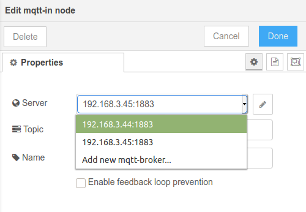

# Configuration nodes

This section is largely citing the Node-RED documentation.

Some nodes need to share configuration. For example, the MQTT In and MQTT Out nodes share the configuration of the MQTT broker, allowing them to pool the connection. Configuration nodes are scoped globally, this means the state will be shared between flows.

An additional common use of config nodes is to represent a shared connection to a remote system. In that instance, the config node may also be responsible for creating the connection and making it available to the nodes that use the config node.

## Defining the HTML part of a config node

A configuration node is defined in the same way as other nodes. There are two key differences:

1. its `category` property is set to `config`
2. the edit template `<input>` elements have ids of `node-config-input-<propertyname>`

### :fa-file: remote-server.html

```html
<script type="text/javascript">
    RED.nodes.registerType('remote-server',{
        category: 'config',
        defaults: {
            host: {value:"localhost",required:true},
            port: {value:1234,required:true,validate:RED.validators.number()},
        },
        label: function() {
            return this.host+":"+this.port;
        }
    });
</script>

<script type="text/html" data-template-name="remote-server">
    <div class="form-row">
        <label for="node-config-input-host"><i class="fa fa-bookmark"></i> Host</label>
        <input type="text" id="node-config-input-host">
    </div>
    <div class="form-row">
        <label for="node-config-input-port"><i class="fa fa-bookmark"></i> Port</label>
        <input type="text" id="node-config-input-port">
    </div>
</script>
```

### Using a config node

Nodes register their use of config nodes by adding a property to the `defaults` array with the `type` attribute set to the type of the config node.

```html
defaults: {
   server: {value:"", type:"remote-server"},
},
```

As with other properties, the editor looks for an `<input>` in the edit template with an id of `node-input-<propertyname>`. Unlike other properties, the editor replaces this `<input>` element with a `<select>` element populated with the available instances of the config node, along with a button to open the config node edit dialog.



## Defining the code part of a config node

### PHP

#### :fa-file: remote-server.s.php

PHP configuration nodes are implemented the same way as a stateful PHP node. There is just one more required method: `getConfigParamaterIncoming`.

```php
public function getConfigParameterIncoming($key) {
    return [
        'hostname' => $this->nodeInfo['info']['hostname'],
        'username' => $this->nodeInfo['info']['user'],
        'password' => $this->getNodeData('credentials')['password']
    ];
}
```

#### :fa-file: my-node.php

To request the configuration parameters from the configuration node, call `getConfigParameter`. The configuration parameters should be retrieved in `configNodesStarted`.

```php
class HomegearNode extends HomegearNodeBase
{
    //...
    
    public function configNodesStarted() {
		$configuration = $this->getConfigParameter($nodeId, $key);
        
        //Do something with $configuration.
    }
    
    //...
}
```

### Providing shared connection

When providing a shared connection it is also necessary to establish bidirectional communication between the configuration node and the node using it. For this you can use the method [`invokeNodeMethod`](https://ref.homegear.eu/php.html#HomegearNodeBaseinvokeNodeMethod):

```php
/*
 * The first parameter is the node ID to call the method on.
 * The second parameter is the method's name.
 * The third parameter are the parameters.
 * The fourth parameter should be set to false if you don't need the return value. This increases performance.
 */
$this->invokeNodeMethod($this->nodeInfo['info']['server'], 'registerNode', [self::NODE_ID], false);
```

This calls the method `registerNode`. An example implementation might look like this:

```php
class HomegearNode extends HomegearNodeBase
{
    //...
    
    public function registerNode(string nodeId) {
        //Do something
    }
    
    //...
}
```

An example implementation can be found here:  https://github.com/codmpm/node-blue-node-mysql/blob/master/mysql-server.s.php (thanks to @pmayer).

### JavaScript

#### :fa-file: remote-server.js

```javascript
module.exports = function(RED) {
    function RemoteServerNode(n) {
        RED.nodes.createNode(this,n);
        this.host = n.host;
        this.port = n.port;
    }
    RED.nodes.registerType("remote-server",RemoteServerNode);
}
```

In this example, the node acts as a simple container for the configuration - it has no actual runtime behavior. When the config node provides a shared connection, it should also handle the [`close` event](https://doc.node-blue.com/creating_nodes/javascript_code_files/#closing-the-node) to disconnect when the node is stopped.

#### :fa-file: my-node.js

The node can then use this property to access the config node within the runtime.

```javascript
module.exports = function(RED) {
    function MyNode(config) {
        RED.nodes.createNode(this,config);

        // Retrieve the config node
        this.server = RED.nodes.getNode(config.server);

        if (this.server) {
            // Do something with:
            //  this.server.host
            //  this.server.port
        } else {
            // No config node configured
        }
    }
    RED.nodes.registerType("my-node",MyNode);
}
```

## C++

### Configuration node

#### :fa-file: remote-server.h

C++ configuration nodes are implemented the same way as any other node. There is just one more method required to override: `getConfigParamaterIncoming`. The header and source file below show a fully working implementation of a configuration node:

```c++
#ifndef MYNODE_H_
#define MYNODE_H_

#include <homegear-node/INode.h>

namespace MyNode {

class MyNode : public Flows::INode {
 public:
  MyNode(const std::string &path, const std::string &type, const std::atomic_bool *frontendConnected);
  ~MyNode() override = default;

  bool init(const Flows::PNodeInfo &info) override;

  Flows::PVariable getConfigParameterIncoming(const std::string &name) override;
 private:
  Flows::PVariable _settings;
};

}
#endif
```

#### :fa-file: remote-server.cpp

```c++
#include "MyNode.h"

namespace MyNode {

MyNode::MyNode(const std::string &path, const std::string &type, const std::atomic_bool *frontendConnected)
    : Flows::INode(path, type, frontendConnected) {
}

bool MyNode::init(const Flows::PNodeInfo &info) {
  _settings = info->info;

  return true;
}

Flows::PVariable MyNode::getConfigParameterIncoming(const std::string &name) {
  try {
    auto settingsIterator = _settings->structValue->find(name);
    if (settingsIterator != _settings->structValue->end()) return settingsIterator->second;
  }
  catch (const std::exception &ex) {
    _out->printEx(__FILE__, __LINE__, __PRETTY_FUNCTION__, ex.what());
  }
  return std::make_shared<Flows::Variable>();
}

}
```

### Client node

#### :fa-file: my-node.cpp

To request the configuration parameters from the configuration node, call `getConfigParameter`. The configuration parameters should be retrieved in `configNodesStarted`.

```c++
auto data = getConfigParameter(remoteServerNodeId, "my-setting");
```

### Providing shared connection

When providing a shared connection it is also necessary to establish bidirectional communication between the configuration node and the node using it. For this you can use the method [`invokeNodeMethod`](https://ref.homegear.eu/php.html#HomegearNodeBaseinvokeNodeMethod):

```c++
/*
 * The first parameter is the node ID to call the method on.
 * The second parameter is the method's name.
 * The third parameter are the parameters.
 * The fourth parameter should be set to false if you don't need the return value. This increases performance.
 */
auto parameters = std::make_shared<Flows::Array>();
parameters->emplace_back(std::make_shared<Flows::Variable>(_id));
auto result = invokeNodeMethod(myServerNodeId, 'registerNode', parameters, true);
```

This calls the method `registerNode`. An example implementation might look like this:

```c++
MyNode::MyNode(const std::string &path, const std::string &type, const std::atomic_bool *frontendConnected)
    : Flows::INode(path, type, frontendConnected) {
    //Local RPC methods is defined in Flows::INode
    _localRpcMethods.emplace("registerNode", std::bind(&MyNode::registerNode, this, std::placeholders::_1));
}

//Register node is called by invokeLocal() implemented by Flows::INode
Flows::PVariable MyNode::registerNode(const Flows::PArray &parameters) {
  try {
    if (parameters->size() != 1) {
        return Flows::Variable::createError(-1,
                                            "Method expects exactly one parameter. " +
                                            std::to_string(parameters->size()) + " given.");
    }
    if (parameters->at(0)->type != Flows::VariableType::tString ||
        parameters->at(0)->stringValue.empty()) {
        return Flows::Variable::createError(-1, "Parameter is not of type string.");
    }

    //Do something

    return std::make_shared<Flows::Variable>();
  }
  catch (const std::exception &ex) {
    _out->printEx(__FILE__, __LINE__, __PRETTY_FUNCTION__, ex.what());
  }
  //Always return -32500 on application errors.
  return Flows::Variable::createError(-32500, "Unknown application error.");
}
```

