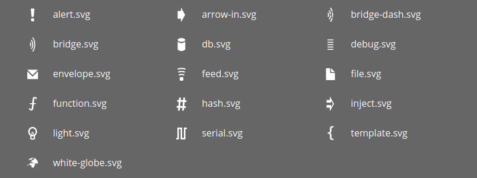
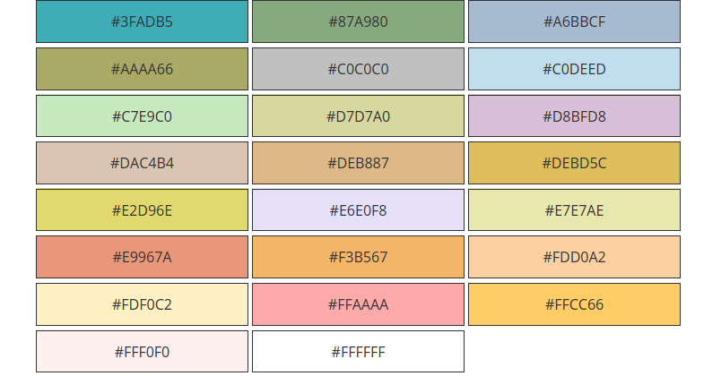
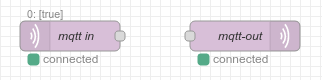
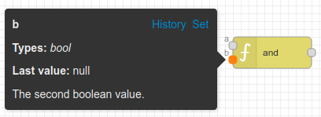
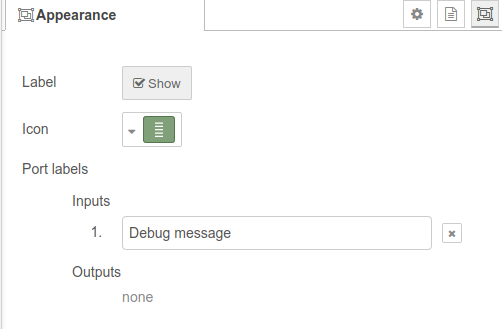
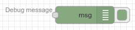

# Node appearance

This section is largely citing the Node-RED documentation.

There are three aspects of a node’s appearance that can be customized: the icon, background color and its label.

## Icon

The node's icon is specified by the `icon` property in its definition.

The value of the property can be either a string or a function.

If the value is a string, that is used as the icon.

If the value is a function, it will get evaluated when the node is first loaded, or after it has been edited. The function is expected to return the value to use as the icon.

The function will be called both for nodes in the workspace, where `this` references a node instance, as well as for the node’s entry in the palette. In this latter case, `this` will not refer to a particular node instance and the function *must* return a valid value.

```javascript
...
icon: "file.png",
...
```

The icon can be either:

- the name of a stock icon provided by Node-BLUE,
- the name of a custom icon provided by the module,
- a Font Awesome 4.7 icon

### Stock icons



### Custom icons

A node can provide its own icon in a directory called `icons` alongside its code and `.html` files. These directories get added to the search path when the editor looks for a given icon filename. Because of this, the icon filename must be unique.

The icon should be white on a transparent background, with a 2:3 aspect ratio, with a minimum of 40 x 60 in size.

### Font Awesome icon

Node-BLUE includes the full set of [Font Awesome 4.7 icons](https://fontawesome.com/v4.7.0/icons/).

To specify a FA icon, the property should take the form:

```javascript
...
icon: "font-awesome/fa-automobile",
...
```

### User defined icon

Individual node icons can be customised by the user within the editor on the ‘appearance’ tab of the node’s edit dialog.

!!! note
    If a node has an `icon` property in its `defaults` object, its icon cannot be customised.

## Background color

The node background color is one of the main ways to quickly distinguish different node types. It is specified by the `color` property in the node definition.

```javascript
...
color: "#a6bbcf",
...
```

We have used a muted palette of colors. New nodes should try to find a color that fits with this palette.

Here are some of the commonly used colors:



## Labels

There are four label properties of a node; `label`, `paletteLabel`, `outputLabel` and `inputLabel`.

### Node label

The `label` of a node in the workspace can either be a static piece of text, or it can be set dynamically on a per-node basis according to the properties of the node.

The value of the property can be either a string or a function.

If the value is a string, that is used as the label.

If the value is a function, it will get evaluated when the node is first loaded, or after it has been edited. The function is expected to return the value to use as the label.

As mentioned in a previous section, there is a convention for nodes to have a `name` property to help distinguish between them. The following example shows how the `label` can be set to pick up the value of this property or default to something sensible.

```javascript
...
label: function() {
    return this.name||"lower-case";
},
...
```

Note that it is not possible to use [credential](node_credentials.md) properties in the label function.

### Palette label

By default, the node's type is used as its label within the palette. The `paletteLabel` property can be used to override this.

As with `label`, this property can be either a string or a function. If it is a function, it is evaluated once when the node is added to the palette.

### Label style

The css style of the label can also be set dynamically, using the `labelStyle` property. Currently, this property must identify the css class to apply. If not specified, it will use the default `node_label` class. The only other predefined class is `node_label_italic`.

The following example shows how `labelStyle` can be set to `node_label_italic` if the `name` property has been set:

```javascript
...
labelStyle: function() {
    return this.name?"node_label_italic":"";
},
...
```

### Alignment

By default, the icon and label are left-aligned in the node. For nodes that sit at the end of a flow, the convention is to right-align the content. This is done by setting the `align` property in the node definition to `right`:

```javascript
...
align: 'right',
...
```



### Port labels

Nodes can provide labels and descriptions on their input and output ports that can be seen by hovering the mouse over the port.

Port labels can either be set statically by the node's html file



```javascript
inputInfo: [
    {
        label: "a",
        types: ["bool"]
    },
    {
        label: "b",
        types: ["bool"]
    }
],
outputInfo: [
    {
        label: "result"
        types: ["bool"]
    }
]
```

port descriptions by the node's localization file

```json
{
  "and": {
    ...
    "input1Description": "The first boolean value.",
    "input2Description": "The second boolean value.",
    "output1Description": "Outputs the result of the boolean comparison.",
    ...
  }
}
```

or both can be generated by a function, that is passed an index to indicate the output pin (starting from 0).

```javascript
...
inputInfo: function(index) {
    return {
        types: ["bool"],
        label: "My label for input port " + index,
        description: "My description"
    }
},
outputInfo: function(index) {
    return {
        types: ["bool"],
        label: "My label for output port " + index,
        description: "My description"
    }
}
...
```

In both cases the label can be overwritten by the user using the `node settings` section of the configuration editor.





!!! Note
    Labels are not generated dynamically, and cannot be set by `msg` properties.

## Buttons

A node can have a button on its left or right hand edge, as seen with the core Inject and Debug nodes.

A key principle is the editor is not a dashboard for controlling your flows. So in general, nodes should not have buttons on them. The Inject and Debug nodes are special cases as the buttons play a role in the development of flows.

The `button` property in its definition is used to describe the behavior of the button. It must provide, as a minimum, an `onclick` function that will be called when the button is clicked.

```javascript
...
button: {
    onclick: function() {
        // Called when the button is clicked
    }
},
...
```

The property can also define an `enabled` function to dynamically enable and disable the button based on the node's current configuration. Similarly, it can define a `visible` function to determine whether the button should be shown at all.

```javascript
...
button: {
    enabled: function() {
        // return whether or not the button is enabled, based on the current
        // configuration of the node
        return !this.changed
    },
    visible: function() {
        // return whether or not the button is visible, based on the current
        // configuration of the node
        return this.hasButton
    },
    onclick: function() { }
},
...
```

The `button` can also be configured as a toggle button - as seen with the Debug node. This is done by added a property called `toggle` that identifies a property in the node’s `defaults` object that should be used to store a boolean value whose value is toggled whenever the button is pressed.

```javascript
...
defaults: {
    ...
    buttonState: {value: true}
    ...
},
button: {
    toggle: "buttonState",
    onclick: function() { }
}
...
```

