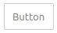
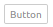
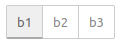
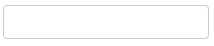
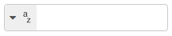
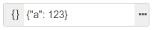
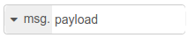

# Node edit dialog

The edit dialog for a node is the main way a user can configure the node to do what they want.

The dialog should be intuitive to use and be consistent in its design and appearance when compared to other nodes.

The edit dialog is provided in the [node's HTML file](html_file.md), inside a `<script>` tag:

```html
<script type="text/html" data-template-name="node-type">
    <!-- edit dialog content  -->
</script>
```

- The `<script>` tag should have a `type` of `text/html` - this will help most text editors to provide proper syntax highlighting. It also prevents the browser from treating it like normal HTML content when the node is loaded into the editor.
- The tag should have its `data-template-name` set to the type of the node its the edit dialog for. This is how the editor knows what content to show when editing a particular node.

The edit dialog will typically be made up from a series of rows - each containing a label and input for a different property

```html
<div class="form-row">
    <label for="node-input-name"><i class="fa fa-tag"></i> Name</label>
    <input type="text" id="node-input-name" placeholder="Name">
</div>
```

- Each row is created by a `<div>` with class `form-row`
- A typical row will have a `<label>` that contains an icon and the name of the property followed by an `<input>`. The icon is created using an `<i>` element with a class taken from those available from [Font Awesome 4.7](https://fontawesome.com/v4.7.0/icons/).
- The form element containing the property must have an id of `node-input-<propertyname>`. In the case of Configuration nodes, the id must be `node-config-input-<property-name>`.
- The `<input>` type can be either `text` for string/number properties, or `checkbox` for boolean properties. Alternatively, a `<select>` element can be used if there is a restricted set of choices.

Node-BLUE provides some standard UI widgets that can be used by nodes to create a richer and more consistent user experience.

## Buttons

To add a button to the edit dialog, use the standard `<button>` HTML element and give it the class `red-ui-button`.

### Plain button



```html
<button type="button" class="red-ui-button">Button</button>
```

### Small button



```html
<button type="button" class="red-ui-button red-ui-button-small">Button</button>
```

### Toggle button group



#### HTML

```html
<span class="button-group">
<button type="button" class="red-ui-button toggle selected my-button-group">b1</button><button type="button" class="red-ui-button toggle my-button-group">b2</button><button type="button" class="red-ui-button toggle my-button-group">b3</button>
</span>
```

#### oneditprepare

```javascript
$(".my-button-group").on("click", function() {
    $(".my-button-group").removeClass("selected");
    $(this).addClass("selected");
})
```

To toggle the `selected` class on the active button, you will need to add code to the `oneditprepare` function to handle the events.

!!! Note
    avoid whitespace between the `<button>` elements as the `button-group` span does not currently collapse whitespace properly. This will be addressed in the future.

## Inputs

For simple text entry, the standard `<input>` element can be used.

In some cases, Node-BLUE provides the `TypedInput` widget as an alternative. It allows the user a way to specify the type of the property as well as its value.

For example, if a property could be a String, number or boolean. Or if the property is being used to identify message, flow or global context property.

Full API documentation for the `TypedInput` widget, including a list of the available built-in types is available [here](editor_ui_widgets.md).

### Plain HTML input



```html
<input type="text" id="node-input-name">
```

### TypedInput String/Integer/Float/Boolean/Array/Struct



#### HTML

```html
<input type="text" id="node-input-example1">
<input type="hidden" id="node-input-example1-type">
```

#### oneditprepare

```javascript
$("#node-input-example1").typedInput({
    type:"string",
    types:["string","int","float","bool","arraySimple","structSimple"],
    typeField: "#node-input-example1-type"
})
```

When the TypedInput can be set to multiple types, an extra node property is required to store information about the type. This is added to the edit dialog as a hidden `<input>`.

### TypedInput JSON



#### HTML

```html
<input type="text" id="node-input-example2">
```

#### oneditprepare

```javascript
$("#node-input-example2").typedInput({
    type:"json",
    types:["json"]
})
```

The JSON type includes a button that will open up a dedicated JSON Edit Dialog.

### TypedInput msg/flow/global



#### HTML

```html
<input type="text" id="node-input-example3">
<input type="hidden" id="node-input-example3-type">
```


#### oneditprepare

```javascript
$("#node-input-example3").typedInput({
    type:"msg",
    types:["msg", "flow","global"],
    typeField: "#node-input-example3-type"
})
```

## Multiple-line text editor

Node-BLUE includes a multi-line text editor based on the [Ace code editor](https://ace.c9.io/).


In the following example, the node property that we will edit is called `exampleText`.

In your HTML, add a `<div>` placeholder for the editor. This must have the css class `node-text-editor`. You will also need to set a `height` on the element.

```html
<div style="height: 250px; min-height:150px;" class="node-text-editor" id="node-input-example-editor"></div>
```

In the node’s `oneditprepare` function, the text editor is initialised using the `RED.editor.createEditor` function:

```javascript
this.editor = RED.editor.createEditor({
   id: 'node-input-example-editor',
   mode: 'ace/mode/text',
   value: this.exampleText
});
```

The `oneditsave` and `oneditcancel` functions are also needed to get the value back from the editor when the dialog is closed, and ensure the editor is properly removed from the page.

```javascript
oneditsave: function() {
    this.exampleText = this.editor.getValue();
    this.editor.destroy();
    delete this.editor;
},
oneditcancel: function() {
    this.editor.destroy();
    delete this.editor;
},
```

