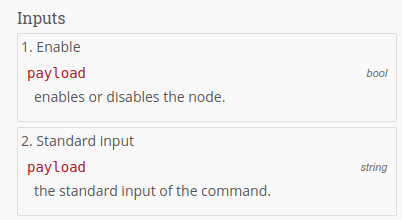
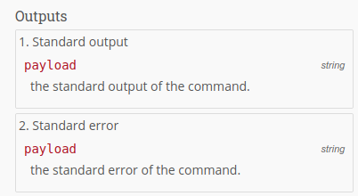
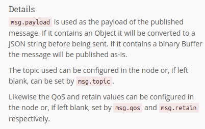
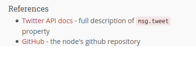

# Node help style guide

When a node is selected, its help text is displayed in the info tab. This help should provide the user with all the information they need in order to use the node.

The following style guide describes how the help should be structured to ensure a consistent appearance between nodes.

!!! node
    We know that not all core nodes follow this style guide. The help of these nodes needs to be reworked - help is appreciated.

Help files are always localized. Place them into the directory `locales/<language code>/<node type>.help.html`. When your node type is `my-node` and the language is English, the directory would be: `locales/en/my-node.help.html`. For US English specifically it would be `locales/en-US/my-node.help.html`.

## Palette help

The palette help is shown as a tooltip when hovering over the node. Place them into your nodes localization JSON file under the key `paletteHelp`. E. g. if your node's type is `my-node`:

```json
{
  "my-node": {
    ...
    "paletteHelp": "Outputs all events transmitted from Homegear to Node-BLUE."
    ...
  }
}
```

## Help sections

### Short description


This section provides a high-level introduction to the node. It should be        no more than 2 or 3 `<p>` long. The first `<p>`        is used as the tooltip when hovering over the node in the palette.

### Inputs



If the node has inputs, this section describes the properties of the messages the node will use. The expected type of each property can also be provided. The description should be brief - if further description is needed, it should be in the Details section. If the node has multiple outputs, a separate property list can be provided for each.

### Outputs



If the node has outputs, as with the Inputs section, this section describes the properties of the messages the node will send. If the node has multiple outputs, a separate property list can be provided for each.     

### Details



This section provides more detailed information about the node. It should explain how it should be used, providing more information on its inputs/outputs.

### References



This section can be used to provide links to external resources, such as:

- any relevant additional documentation. Such as how the Template node links to the Mustache language guide.
- the node's git repository or npm page - where the user can get additional help

### Example HTML

The above example was created with the following HTML.

```html
<script type="text/html" data-help-name="node-type">
<p>Connects to a MQTT broker and publishes messages.</p>

<h3>Inputs</h3>
    <ol class="node-ports">
        <li>Enable
            <dl class="message-properties">
                <dt>payload <span class="property-type">bool</span></dt>
                <dd>enables or disables the node.</dd>
            </dl>
        </li>
        <li>Standard input
            <dl class="message-properties">
                <dt>payload <span class="property-type">string</span></dt>
                <dd>the standard input of the command.</dd>
            </dl>
        </li>
    </ol>

<h3>Outputs</h3>
    <ol class="node-ports">
        <li>Standard output
            <dl class="message-properties">
                <dt>payload <span class="property-type">string</span></dt>
                <dd>the standard output of the command.</dd>
            </dl>
        </li>
        <li>Standard error
            <dl class="message-properties">
                <dt>payload <span class="property-type">string</span></dt>
                <dd>the standard error of the command.</dd>
            </dl>
        </li>
    </ol>

<h3>Details</h3>
    <p><code>msg.payload</code> is used as the payload of the published message.
    If it contains an Object it will be converted to a JSON string before being sent.
    If it contains a binary Buffer the message will be published as-is.</p>
    <p>The topic used can be configured in the node or, if left blank, can be set
    by <code>msg.topic</code>.</p>
    <p>Likewise the QoS and retain values can be configured in the node or, if left
    blank, set by <code>msg.qos</code> and <code>msg.retain</code> respectively.</p>

<h3>References</h3>
    <ul>
        <li><a>Twitter API docs</a> - full description of <code>msg.tweet</code> property</li>
        <li><a>GitHub</a> - the nodes github repository</li>
    </ul>
</script>

```

## Elements

### Section headers

Each section must be marked up with an `<h3>` tag. If the `Details` section needs sub headings, they must use `<h4>` tags.

```html
<h3>Inputs</h3>
...
<h3>Details</h3>
...
 <h4>A sub section</h4>
 ...
```

### Message properties

Each item in the list consists of a pair of `<dt>` and `<dd>` tags.

Each `<dt>` contains the property name and an optional `<span class="property-type">` that contains the expected type of the property. If the property is optional, the `<dt>` should have a class attribute of `optional`.

Each `<dd>` contains a brief description of the property.

```html
<dl class="message-properties">
    <dt>payload
        <span class="property-type">string | buffer</span>
    </dt>
    <dd> the payload of the message to publish. </dd>
    <dt class="optional">topic
        <span class="property-type">string</span>
    </dt>
    <dd> the MQTT topic to publish to.</dd>
</dl>
```

### Multiple inputs / outputs

If the node has multiple inputs or outputs, each input/output should have its own message property list, as described above. Those lists should be wrapped in a `<ol>` list with a class attribute of `node-ports`

Each item in the list should consist of a brief description of the input/output followed by a `<dl>` message property list.

!!! note
    If the node has a single input or output, it should not be wrapped in such a list and just the `<dl>` used.

```html
<ol class="node-ports">
    <li>Standard output
        <dl class="message-properties">
            <dt>payload <span class="property-type">string</span></dt>
            <dd>the standard output of the command.</dd>
        </dl>
    </li>
    <li>Standard error
        <dl class="message-properties">
            <dt>payload <span class="property-type">string</span></dt>
            <dd>the standard error of the command.</dd>
        </dl>
    </li>
</ol>
```

### General guidance

When referencing a message property outside of a message property list described above, they should be prefixed with `msg.` to make it clear to the reader what it is. They should be wrapped in `<code>` tags.

```html
The interesting part is in <code>msg.payload</code>.
```

No other styling markup (e.g. `<b>`,`<i>`) should be used within the body of the help text.

The help should not assume the reader is an experienced developer or deeply familiar with whatever the node exposes; above all, it needs to be helpful.