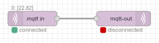

# Node status

This section is largely citing the Node-RED documentation.

Whilst running, a node is able to share status information with the editor UI. For example, the MQTT nodes can indicate if they are currently connected or not.



## Setting status

Setting status differs a little between the available programming languages. But in all languages a status object is required. The status object is described in the next section.

### PHP

```php
$this->nodeEvent('status/'.self::NODE_ID, ['text' => 'connected', 'fill' => 'green', 'shape' => 'dot']);
```

### JavaScript

```javascript
this.homegear.invoke("nodeEvent", ["status/" + this.id, {text: "connected", fill: "green", shape: "dot"}]);
```

Alternatively the status function can be used in JavaScript:

```javascript
this.status({fill:"green",shape:"dot",text:"connected"});
```

### Python

```python
hg = Homegear(sys.argv[1], eventHandler, sys.argv[2], nodeInput)
nodeId = sys.argv[2]

...

hg.nodeEvent("status/" + nodeId, {"text": "connected", "fill": "green", "shape": "dot"})
```

### C++

```
Flows::PVariable status = std::make_shared<Flows::Variable>(Flows::VariableType::tStruct);
status->structValue->emplace("text", std::make_shared<Flows::Variable>("connected"));
status->structValue->emplace("fill", std::make_shared<Flows::Variable>("green"));
status->structValue->emplace("shape", std::make_shared<Flows::Variable>("dot"));
nodeEvent("status/" + _id, status);
```

## Status object

A status object consists of three properties: `fill`, `shape` and `text`.

The first two define the appearance of the status icon and the third is an optional short piece of text (under <20 characters) to display alongside the icon.

The `shape` property can be: `ring` or `dot`.

The `fill` property can be: `red`, `green`, `yellow`, `blue` or `grey`

This allows for the following icons to be used:


If the status object is an empty object, `{}`, then the status entry is cleared from the node.

## Status node

The Status node can be used to catch any node status updates, for example connect and disconnect messages, in order to trigger other flows.

